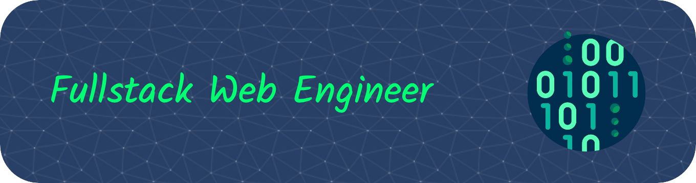

<!-- Hi there 👋 -->

### ⚡ Skill Highlights 👨‍💻

<!--

-->

For more details, please visit my [portfolio page](https://pnaylor.github.io) and [LinkedIn profile](https://www.linkedin.com/in/naylorp) .

<!--

**pnaylor/pnaylor** is a ✨ _special_ ✨ repository because its `README.md` (this file) appears on your GitHub profile.

Here are some ideas to get you started:

- 🔭 I’m currently working on ...
- 🌱 I’m currently learning ...
- 👯 I’m looking to collaborate on ...
- 🤔 I’m looking for help with ...
- 💬 Ask me about ...
- 📫 How to reach me: ...
- 😄 Pronouns: ...
- ⚡ Fun fact: ...
-->
